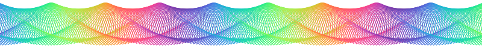

::: teaser {#teaser}

| A teaser image for the beginning of our article. [Scroll down for an interactive version!]{.html:only}
:::

::: abstract
With Living Papers, you can author an interactive web page or standard reseach paper from Markdown source documents.
This example article demonstrates the basic syntax and functionality of a Living Papers document.
Compare the [source markup](https://raw.githubusercontent.com/uwdata/living-papers-template/main/index.md) and the resulting [rendered web page](https://uwdata.github.io/living-papers-template/)!
:::

# Basic Formatting

Basic formatting includes:

- Inline text with _italics_, **bold**, or ***both***.
- Inline code `x = Math.PI * r * r`.
- Inline code with syntax highlighting `x = Math.PI * r * r`{.js}.
- Inline math $x = \pi * r^2$.
- Super^script^, sub~script~, and ~~strikethrough~~.
- [Hyperlinks](https://github.com/uwdata/living-papers) and [styled spans]{.underline .smaller}.
- Lists (like this one!)

<!--
We can use HTML comment syntax for content we don't want in the output.
-->

# Math & Equations

Mathematical notation is specified using [TeX syntax](https://en.wikibooks.org/wiki/LaTeX/Mathematics).
Inline math ($e^{i\pi}$), `math` blocks, and numbered `equation` blocks are supported.
Compare a `math` block:

~~~ math
-b \pm \sqrt{b^2 - 4ac} \over 2a
~~~

And an `equation` block:

~~~ equation {#ratio}
\frac{a + b}{a} = \frac{a}{b} = \phi
~~~

# Figures & Tables

<!--
Figures and tables are placed in the main column by default.
Use the {.margin} class to place them in the right margin,
or use the `{.page}` class to span the page width.
-->

::: table {#irrational .margin}
| Symbol | Value       |
| :----- | ----------- |
| $\phi$ | 1.618033... |
| $\pi$  | 3.141519... |
| $e$    | 2.718282... |

| Some irrational numbers.
:::

<!--
Captions are distinguished from figure/table content using a preceding pipe (`|`) character.
To avoid confusion, table content and captions must be separated by an empty line.
-->

Basic images and tables can be included without adornment using standard Markdown.
To create numbered and captioned elements, place content within `:::`-fenced `figure` or `table` blocks.

::: figure {#goldenratio .center}

| A depiction of the Golden Ratio ($\phi$).
:::

# Citations

Give credit where credit is due!
Living Papers was inspired by earlier work by @doi:10.1145/3242587.3242600 on the [Idyll language](https://idyll-lang.org/docs).
Living Papers supports citations references with author name(s) or with reference number only [@doi:10.1145/3242587.3242600].
Citations are also _interactive_: click/tap a citation to view a pop-up with more information.

Citation information can be automatically retrieved using a unique ID:

- A DOI `[@doi:10.1145/3242587.3242600]` → [@doi:10.1145/3242587.3242600]
- A Semantic Scholar ID `[@s2id:4fca64e6dc4e803d3ed904c04c6845a9e6adc53e]` → [@s2id:4fca64e6dc4e803d3ed904c04c6845a9e6adc53e]

Citations can also be defined in [BibTeX](https://en.wikipedia.org/wiki/BibTeX) format, either in an external file (listed under the `references` key of the article metadata) or included anywhere in the document in a `bibliography` block:

``` {.smaller}
~~~ bibliography
@inproceedings{conlen2021,
  title={Idyll Studio: A structured editor for authoring interactive \& data-driven articles},
  author={Conlen, Matthew and Vo, Megan and Tan, Alan and Heer, Jeffrey},
  booktitle={The 34th Annual ACM Symposium on User Interface Software and Technology},
  pages={1--12},
  year={2021}
}
~~~
```

For example, @conlen2021 (`@conlen2021`) extends Idyll with a graphical structured editor to create interactive articles without writing markup code.

To create a list of citations [@doi:10.1145/3242587.3242600; @conlen2021], separate references with semi-colons: `[@doi:10.1145/3242587.3242600; @conlen2021]`.

~~~ bibliography
@inproceedings{conlen2021,
  title={Idyll Studio: A structured editor for authoring interactive \& data-driven articles},
  author={Conlen, Matthew and Vo, Megan and Tan, Alan and Heer, Jeffrey},
  booktitle={The 34th Annual ACM Symposium on User Interface Software and Technology},
  pages={1--12},
  year={2021}
}
~~~

# Cross-References and Notes

Cross-references use a syntax similar to citations:

- Figures: `@fig:teaser` → @fig:teaser, `@fig:goldenratio` → @fig:goldenratio
- Tables: `@tbl:irrational` → @tbl:irrational
- Equations: `@eqn:ratio` → @eqn:ratio

By default, a descriptive prefix like "Figure" is included.^[To show a reference number only, wrap the reference like so: `[-@fig:goldenratio]` → [-@fig:goldenratio].]

# Interactive Figures

<!--
JavaScript code blocks evaluate code in the Observable JavaScript dialect.
Use the hide attribute to prevent output from being shown in the document.
To show JavaScript code (not evaluate it) use the { .code } class.
-->

``` js { hide=true }
import { Scrubber } from "@jheer/scrubber"
```

::: figure {.html:only}
``` js
viewof rot = Scrubber([0, 10], {
  step: 0.05,
  value: 5,
  alternate: true,
  label: 'Rotation',
  format: x => x.toFixed(2)
})
```

``` js
viewof sep = Scrubber([1, 100], {
  value: 4,
  alternate: true,
  label: 'Separation'
})
```

<!--
We can define multiple code cells using the --- delimiter.
Only output from the last cell is shown.
-->

``` js
size = 25
---
n = Math.ceil((800 + 4*size) / sep)
---
pad = 30
---
color = d3.scaleSequential(d3.interpolateRainbow).domain([360, 0])
---
svg`<svg width="${800}" height="${2*size+pad}" viewBox="0 0 800 ${2*size+pad}">
  ${d3.range(0, n).map(i => {
    const a = (i * rot) % 360;
    return svg`<rect
      transform="translate(${i*sep-2*size-1}, ${pad/2}) rotate(${-a}, ${size}, ${size})"
      width="${2*size}" height="${2*size}"
      fill="none" stroke="${color(a)}"></rect>`;
  })}
  </svg>`
```
| An interactive, explorable version of @fig:teaser. Can you deconstruct the shapes?
:::

``` js { hide=true }
value = -10
---
max = 10
---
step = 0.1
---
sinc = x => x === 0 ? 1 : (Math.sin(Math.PI * x) / (Math.PI * x))
---
format = x => x.toFixed(2).replace('-0.00', '0.00')
```

::: figure { #graph .margin }
``` js
Plot.plot({
  y: { grid: true },
  marks: [
    Plot.ruleX([value], { stroke: '#888' }),
    Plot.line(
      d3.range(-max, Math.max(max + step, value), step),
      { x: x => x, y: x => sinc(x), stroke: 'steelblue', strokeWidth: 2 }
    ),
    Plot.dot([value], { x: x => x, y: x => sinc(x), fill: 'steelblue' })
  ],
  width: 400,
  height: 250
})
```
``` js {bind=value}
Scrubber([-max, max], {
  step, labelWidth: '20px', loop: false,
  label: tex`x`, format: x => x.toFixed(1)
  })
```
| $sinc(x)$ at $x=$ [:range-text:]{min=`-max` max=`max` step=`step` title="Drag to adjust value" bind=value} → $$\sinc(x) = ${format(sinc(value))}$$.
:::

<!--
Above we use the built-in `range-text` component for a draggable number.
Custom web components are specified using the syntax:
 [:component-name:]{attribute1=value1 attribute2=value2}

Under the hood, TeX math elements are also components that support dynamic
updates with embedded JavaScript! If we denote inline math using double
dollar signs ($$), we can then use single dollar signs (${js_code}) for
JavaScript template string interpolation.

We use a `bind` attribute on both the draggable text and code-generated
input elements to _bind_ each of these inputs to a shared value.
The `bind` functionality requires that inputs conform to a simple interface:
the element must fire `input` events upon changes, and expose a `value`
property that can be used to get/set the element's current value.
-->

Living Papers support *interactive* content using JavaScript code blocks and an extensible component system, all connected via a shared reactive runtime.
The runtime automatically re-evaluates page content in response to interactive updates.

Living Papers uses the same JavaScript dialect as [Observable notebooks](https://observablehq.com/@observablehq/a-taste-of-observable).
We can define variables, add input widgets, and generate figures (e.g., using [Vega-Lite](https://observablehq.com/@observablehq/vega-lite) or [Observable Plot](https://observablehq.com/@observablehq/plot), as in @fig:graph) just as we would in a notebook.
We can also directly import content from public Observable notebooks, like this [D3](https://d3js.org/)-based [line chart of unemployment rates by U.S. county](https://observablehq.com/@d3/multi-line-chart):

``` js
chartWidth = 775
---
import { chart as d3LineChart } with { chartWidth as width }
from '@d3/multi-line-chart'
---
d3LineChart
```

# And more...

Living Papers also supports other types of content (not demonstrated here) through custom plugins.
One or more plugins can be specified under the `plugins` article metadata key.
For example:

- The `knitr` plugin evaluates R code blocks (` ```r`) at compile time and includes the results in the output document (similar to [RMarkdown](https://rmarkdown.rstudio.com/)).
- The `pyodide` plugin evaluates Python code blocks (` ```py`) _in the browser_ using  [Pyodide](https://pyodide.org/en/stable/). These Python blocks follow the same reactive logic as Observable JavaScript, and computed Python results are directly accessible from JavaScript.
